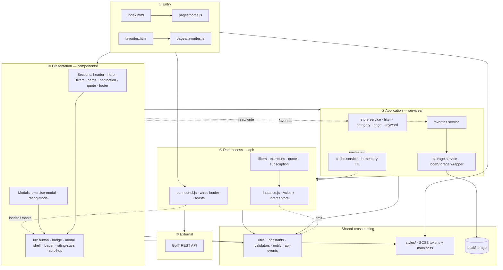
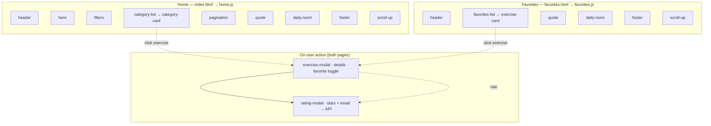
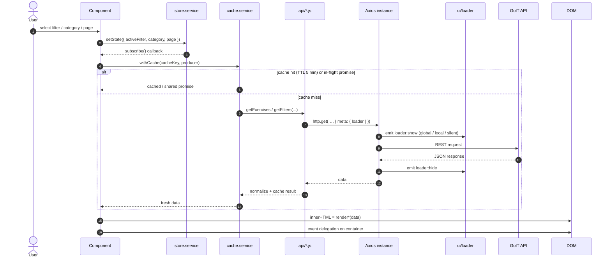

# Your Energy

> Adaptive fitness-exercise catalog with filtering, favorites, detail modals, ratings, and a newsletter subscription. Team project for the **MSc in Software Engineering & AI**, built on a **vanilla stack — no frameworks**.

<p>
  
  
  
  
</p>

## Table of Contents

- [Features](#features)
- [Tech Stack](#tech-stack)
- [Getting Started](#getting-started)
- [Scripts](#scripts)
- [Project Structure](#project-structure)
- [Architecture](#architecture)
  - [Overview](#overview)
  - [Layer model](#layer-model)
  - [Pages & components](#pages--components)
  - [Data flow](#data-flow)
- [Working in `src/` (per-folder guide)](#working-in-src-per-folder-guide)
- [Usage Guide](#usage-guide)
  - [Shared State (store)](#shared-state-store)
  - [Rendering Components (template literals)](#rendering-components-template-literals)
  - [Loading Indicator (loader)](#loading-indicator-loader)
- [API Reference](#api-reference)
- [Code Quality](#code-quality)
- [Deployment](#deployment)
- [Contributing](#contributing)

## Features

- **Two pages** — Home (catalog) and Favorites, built as a multi-page Vite app.
- **Filtering** by Muscles / Body parts / Equipment with server-side pagination.
- **Search** within a selected category (submit-driven).
- **Exercise modal** with details, rating, and add/remove favorites.
- **Rating modal** — star rating + validated email, submitted to the API.
- **Favorites** persisted in `localStorage`, available offline across sessions.
- **Quote of the day** cached in `localStorage` with a date check (no redundant refetch).
- **Newsletter subscription** with email validation.
- **Centralized loader** and **toast notifications** wired through a single Axios instance.

## Tech Stack

| Area          | Choice                                                                       |
| ------------- | ---------------------------------------------------------------------------- |
| Markup        | HTML (two entry points: `index.html`, `favorites.html`)                      |
| Styles        | SCSS — modular architecture (`abstracts` / `base` / `layout` / `pages`)      |
| Logic         | JavaScript ES6+ — DOM rendering via template literals (no template engine)   |
| HTTP          | [Axios](https://axios-http.com/) — single instance + interceptors            |
| Notifications | [iziToast](https://izitoast.marcelodolza.com/), wrapped in `utils/notify.js` |
| Build         | [Vite](https://vitejs.dev/) — multi-page                                     |
| State         | Tiny custom observable store + `localStorage` services                       |
| Tooling       | ESLint (flat config), Prettier, Husky, lint-staged, EditorConfig, `.nvmrc`   |
| CI / Deploy   | GitHub Actions (quality gate) + GitHub Pages                                 |

## Getting Started

**Prerequisites:** Node `>=20` (pinned in [`.nvmrc`](.nvmrc)).

```bash
nvm use            # match the pinned Node version
npm install        # also installs the Husky git hooks (via "prepare")
npm run dev        # Vite dev server → http://localhost:5173
```

## Scripts

| Command                | Description                                       |
| ---------------------- | ------------------------------------------------- |
| `npm run dev`          | Start the Vite dev server.                        |
| `npm run build`        | Production build of **both** pages into `dist/`.  |
| `npm run preview`      | Preview the production build locally.             |
| `npm run lint`         | Lint all sources with ESLint.                     |
| `npm run lint:fix`     | Lint and auto-fix.                                |
| `npm run format`       | Format the codebase with Prettier (writes files). |
| `npm run format:check` | Verify formatting without writing (used in CI).   |

## Project Structure

```
your-energy/
├── public/                  # static assets served as-is (favicon, robots.txt)
├── .github/                 # CI workflow + CODEOWNERS
├── index.html               # Home entry
├── favorites.html           # Favorites entry
└── src/
    ├── api/                 # Axios instance, normalizers, endpoint modules (no DOM)
    ├── components/          # feature components (.js + .scss co-located)
    │   └── ui/              # reusable primitives (button, loader, badge, …)
    ├── services/            # store, favorites, cache, storage (state orchestration)
    ├── utils/               # constants, validators, notify, api-events
    ├── styles/              # abstracts / base / layout / pages + main.scss
    └── pages/               # home.js, favorites.js — page bootstraps
```

## Architecture

Organized **by feature, not by type**, with strict layer boundaries:

- **`api/`** never touches the DOM. All HTTP goes through the shared `http` instance ([`api/instance.js`](src/api/instance.js)); loader and toast side effects are emitted as events and wired in [`api/connect-ui.js`](src/api/connect-ui.js) at page bootstrap.
- **`services/`** never call the backend directly — they orchestrate `api/` together with the store, cache, and storage.
- **`components/`** only render and listen for events. They read shared state from [`services/store.service.js`](src/services/store.service.js) and persist favorites via [`services/favorites.service.js`](src/services/favorites.service.js).
- **No raw `localStorage` / `JSON.parse`** outside [`services/storage.service.js`](src/services/storage.service.js).
- **No barrel imports** — import directly from the source file.

### Layer model

Dependency direction is **one-way**: `pages → components → services → api`. `utils` is shared everywhere; `styles` are consumed by pages and components. Interceptors emit UI events via [`utils/api-events.js`](src/utils/api-events.js); each page entry calls [`connectApiUi()`](src/api/connect-ui.js) once to attach the loader and toasts — `api/` itself stays UI-agnostic.



### Pages & components

Each HTML page declares empty `[data-component]` slots; the matching `pages/*.js` file mounts components on `DOMContentLoaded`. Modals are **not** mounted on load — they open on user action.



### Data flow

Typical catalog flow: a component updates the store, subscribers react, a service fetches through the cache layer, Axios handles loader + errors, and the component re-renders with template literals.



## Working in `src/` (per-folder guide)

What belongs in each folder, the rules, and a minimal example. The dependency direction is one-way: `pages → components → services → api`, with `utils` shared by all and `styles` consumed by `components`/`pages`. Never import "upwards" (e.g. `api` importing a component). UI side effects from interceptors go through [`utils/api-events.js`](src/utils/api-events.js) and are wired in [`api/connect-ui.js`](src/api/connect-ui.js) at page bootstrap.

### `src/api/` — backend access

One module per API resource plus the shared axios instance and response normalizers. **No DOM, no business logic, no state.** Each function imports `http`, validates the response shape via [`normalizers.js`](src/api/normalizers.js), and accepts an optional `{ loader }` target.

```js
// api/quote.api.js
import { http } from './instance.js';
import { normalizeQuote } from './normalizers.js';
import { ENDPOINTS } from '../utils/constants.js';

export async function getQuote({ loader } = {}) {
  const { data } = await http.get(ENDPOINTS.quote, { meta: { loader } });
  return normalizeQuote(data);
}
```

> Add new endpoints here, never call `axios` directly from a component, put the URL in [`utils/constants.js`](src/utils/constants.js), and add a guard in `normalizers.js` for the response shape.

### `src/utils/` — pure helpers & constants

Stateless, side-effect-free helpers and shared constants. **No DOM, no HTTP, no state** — except [`api-events.js`](src/utils/api-events.js), a tiny pub/sub bus used by Axios interceptors to emit loader/notify events without importing UI modules. One helper group per file; constants live in [`constants.js`](src/utils/constants.js).

```js
import { isValidEmail } from '../utils/validators.js';
import { EMAIL_PATTERN, STORAGE_KEYS } from '../utils/constants.js';

if (!isValidEmail(email)) notifyError('Invalid email');
```

> A literal used in ≥2 places, or a shared contract (endpoint, storage key, regex), goes here. A one-off string stays inline at its call site.

### `src/services/` — state & orchestration

The stateful layer: the observable **store**, **favorites** (localStorage), **cache** (TTL + in-flight deduplication), and the **storage** wrapper. Services orchestrate `api/` + persistence + state. **No DOM, no markup.** This is the only place allowed to touch `localStorage` (via [`storage.service.js`](src/services/storage.service.js)).

```js
// a feature flow: cache the request, then publish to the store
import { getExercises } from '../api/exercises.api.js';
import { withCache } from '../services/cache.service.js';
import { setState, getState } from '../services/store.service.js';

export async function loadExercises() {
  const { category, page, keyword } = getState();
  const key = `exercises:${category?.name}:${page}:${keyword}`;
  // map the filter type (Muscles/Body parts/Equipment) to its query param
  const data = await withCache(key, () =>
    getExercises({ ...toExerciseParams(category), keyword, page }),
  );
  return data;
}
```

> See [Shared State (store)](#shared-state-store) for the store contract.

### `src/components/` — views

Feature components and reusable `ui/` primitives, each as co-located `*.js` + `*.scss`. A component **renders markup, wires its own listeners, and reads/writes the store** — it never calls the API directly. See [Rendering Components](#rendering-components-template-literals) for the full pattern.

```js
// example — what a finished component looks like (load → render → mount)
import { getQuote } from '../../api/quote.api.js';
import { escapeHtml } from '../../utils/escape-html.js';

export async function mountQuote(root) {
  const { quote, author } = await getQuote();
  root.innerHTML = `
    <figure class="quote">
      <blockquote>${escapeHtml(quote)}</blockquote>
      <figcaption>${escapeHtml(author)}</figcaption>
    </figure>`;
}
```

> **Current state — everything is a wired placeholder, so the app renders out of the box.** Each component is a stub in one of three shapes; replace the markup and add logic, but keep the exported signature so the wiring stays untouched:
>
> - **Sections** (`header`, `hero`, `filters`, `category-card`, `exercise-card`, `pagination`, `quote`, `daily-norm`, `footer`, `scroll-up`) export `mount<Name>(root)` and are already called in both page bootstraps → visible dashed placeholder boxes.
> - **Modals** (`exercise-modal`, `rating-modal`) export `open<Name>(...)` and open on user action (not on load). The shell — backdrop, close button, X / backdrop / Escape handling, listener cleanup, and "one modal at a time" — lives in the `ui/modal` primitive ([`openModal`](src/components/ui/modal/modal.js)); each modal supplies only its body content.
> - **Primitives** (`ui/button`, `ui/badge`, `ui/rating-stars`) export pure `render<Name>(props)` helpers composed inside sections; `ui/loader` and `ui/modal` are the functional primitives (loader + modal shell). Never mount a primitive standalone or duplicate it inside a feature.
>
> The snippet above shows what a finished section component looks like.

### `src/pages/` — entry points

Thin bootstraps — `home.js` and `favorites.js`. They import the global stylesheet, call [`connectApiUi()`](src/api/connect-ui.js) once to wire loader/toast handlers, then mount the page's components. **No rendering logic here** — delegate to components/services.

```js
// pages/home.js
import 'modern-normalize';
import { connectApiUi } from '../api/connect-ui.js';
import '../styles/main.scss';
import { mountQuote } from '../components/quote/quote.js';

function bootstrap() {
  connectApiUi();
  mountQuote(document.querySelector('[data-component="quote"]'));
  // mount header, filters, category list, pagination, footer…
}

document.addEventListener('DOMContentLoaded', bootstrap);
```

### `src/styles/` — SCSS system

`abstracts/` (design tokens, mixins, functions — **emits no CSS**), `base/` (reset, typography, global), `layout/`, `pages/`, and the [`main.scss`](src/styles/main.scss) aggregator. Component styles are co-located with the component and `@use`'d from `main.scss`.

```scss
// components/exercise-card/exercise-card.scss
@use '../../styles/abstracts' as *;

.exercise-card {
  padding: 16px;
  border-radius: $radius-md; // token, never a hardcoded value
  color: $color-text;

  @include respond($bp-tablet) {
    padding: 24px;
  }
}
```

> Consume tokens via `@use '../abstracts' as *` — never hardcode colors/spacing. After adding a new component `.scss`, register it in [`main.scss`](src/styles/main.scss).

## Usage Guide

The three patterns below are the project's shared conventions. Follow them so ten contributors produce one consistent codebase.

### Shared State (store)

[`services/store.service.js`](src/services/store.service.js) is a tiny observable holding the **single source of truth** for shared UI state: `activeFilter`, `category`, `page`, and `keyword`. Components read it, subscribe to changes, and mutate it **only** through `setState`. `getState()` and subscriber callbacks receive a **frozen shallow copy** — never mutate the returned object. The store never calls the API and never touches the DOM.

```js
import { getState, setState, subscribe } from '../services/store.service.js';

// Read current state
const { category, page, keyword } = getState();

// Mutate — every subscriber is notified
setState({ page: 2 });

// React to changes; ALWAYS unsubscribe on teardown (e.g. closing a modal)
const unsubscribe = subscribe((state) => {
  renderExerciseList(state);
});
// later…
unsubscribe();
```

**Why a store?** Without one, each component keeps its own copy of `page` / `category` / favorites and they drift out of sync (e.g. pagination advances but the list stays behind). One source of truth, with subscriptions, keeps every view consistent and keeps components decoupled — pagination doesn't hold a reference to the list, it just writes to the store. Tasks that share state (category selection → exercises → pagination → modal → rating) coordinate exclusively through it.

### Rendering Components (template literals)

There is **no template engine**. Each component exports a pure `render*` function that returns an HTML string built with template literals. The caller injects the markup and then wires listeners.

```js
// components/exercise-card/exercise-card.js
import { escapeHtml } from '../../utils/escape-html.js';

export function renderExerciseCard(exercise) {
  return `
    <article class="exercise-card" data-id="${exercise._id}">
      <h3 class="exercise-card__title">${escapeHtml(exercise.name)}</h3>
      <button class="exercise-card__start" type="button">Start</button>
    </article>
  `;
}
```

```js
// where the list is mounted
container.innerHTML = exercises.map(renderExerciseCard).join('');

// Wire events once on the container (event delegation), not per card
container.addEventListener('click', (event) => {
  const card = event.target.closest('.exercise-card');
  if (card) openExerciseModal(card.dataset.id);
});
```

**Conventions:**

- Keep render functions **pure** — data in, string out. No fetching, no global state reads inside the template.
- **Escape any API- or user-provided string** before interpolating it into markup to avoid XSS.
- Prefer **event delegation** on a stable parent over attaching listeners to every rendered node.
- When a component owns listeners that outlive a render (modals, document-level `keydown`), expose a teardown that removes them.

### Loading Indicator (loader)

The loader is **fully centralized in the Axios interceptors** — feature code never calls `showLoader` / `hideLoader`. Interceptors emit `loader:show` / `loader:hide` events; [`connectApiUi()`](src/api/connect-ui.js) attaches the loader handlers at page bootstrap. Each request declares a target via `config.meta.loader`. Targets are reference-counted by **selector string** (not DOM node reference), so parallel requests to the same target won't hide it early and re-renders of a local container won't orphan the overlay.

```js
import { LOADER } from '../utils/constants.js';
import { setButtonLoading } from '../components/ui/button/button.js';

// 1) Global overlay (default) — pass nothing
await getQuote();

// 2) Local overlay inside a specific container
await getExercises(params, { loader: '[data-component="exercise-list"]' });
await getFilters({ filter }, { loader: '[data-component="category-list"]' });

// 3) Silent — no overlay; the form's button shows its own spinner
setButtonLoading(sendBtn, true);
try {
  await rateExercise(id, payload, { loader: LOADER.SILENT });
} finally {
  setButtonLoading(sendBtn, false);
}
```

**Rule of thumb:** lists / pagination → **local**, rating & subscription forms → **silent + button spinner**, modal opening and everything else → **global**.

## API Reference

Base URL: `https://your-energy.b.goit.study/api` · [Swagger docs](https://your-energy.b.goit.study/api-docs)

| Purpose            | Method | Endpoint                |
| ------------------ | ------ | ----------------------- |
| Filters/categories | GET    | `/filters`              |
| Exercises list     | GET    | `/exercises`            |
| Exercise details   | GET    | `/exercises/:id`        |
| Add rating         | PATCH  | `/exercises/:id/rating` |
| Quote of the day   | GET    | `/quote`                |
| Subscription       | POST   | `/subscription`         |

Email contract (rating + subscription): `^\w+(\.\w+)?@[a-zA-Z_]+?\.[a-zA-Z]{2,3}$`

## Code Quality

Quality is enforced at two layers:

- **On commit** — Husky runs `lint-staged`, which auto-fixes staged files (`eslint --fix` + `prettier --write` for JS, `prettier --write` for SCSS/JSON/MD). Badly formatted code is corrected before it lands.
- **On push / pull request** — the [GitHub Actions workflow](.github/workflows/code-quality.yml) runs on `develop` and `main`: `lint`, `format:check`, and `build`. A red check blocks the merge when branch protection requires status checks.

Run the full gate locally before opening a PR:

```bash
npm run lint
npm run format:check
npm run build
```

## Deployment

Deployed to **GitHub Pages** from the `main` branch. Day-to-day development happens on `develop`; merge `develop` → `main` via pull request when a release is ready.

The Vite `base` in [`vite.config.js`](vite.config.js) must match the repository name (`/your-energy/`); override it with the `VITE_BASE` env var if the repo is named differently.

## Contributing

### Branch workflow

| Branch                       | Role                                                        |
| ---------------------------- | ----------------------------------------------------------- |
| `develop`                    | Default integration branch — feature work merges here first |
| `main`                       | Production / deployable — GitHub Pages deploys from here    |
| `feat/<task>` / `fix/<task>` | Short-lived topic branches off `develop`                    |

**Day-to-day flow:**

1. Update `develop` and branch off it:

   ```bash
   git checkout develop
   git pull origin develop
   git checkout -b feat/my-task
   ```

2. Commit with [Conventional Commits](https://www.conventionalcommits.org/) — `type(scope): subject` (e.g. `feat(filters): add active state toggle`).
3. Push and open a **pull request into `develop`** (not `main`).
4. Wait for CI (`Lint, format & build`) and a code-owner review ([`.github/CODEOWNERS`](.github/CODEOWNERS)).
5. When a release is ready, open a **pull request from `develop` into `main`**.

**Protected branches:** `main` and `develop` do not accept direct pushes — all changes go through reviewed pull requests.

### Code boundaries

Keep the layer rules in [Architecture](#architecture) — `api/` has no DOM, `services/` don't call the backend directly, `components/` only render and react to the store, interceptors emit UI events instead of importing components. No barrel imports.

### Before a PR

Run the full quality gate locally:

```bash
npm run lint
npm run format:check
npm run build
```
