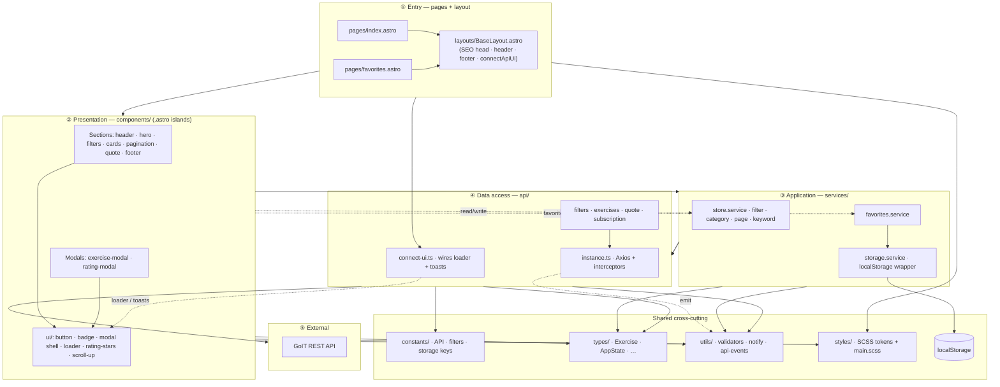
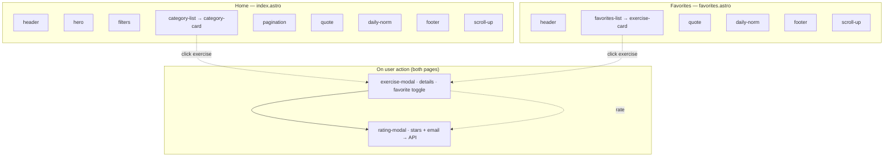
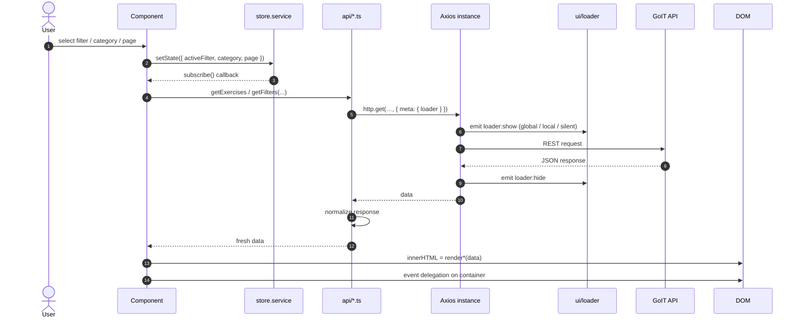

# GoFit

> Adaptive fitness-exercise catalog with filtering, favorites, detail modals, ratings, and a newsletter subscription. Team project for the **MSc in Software Engineering & AI**, built with **Astro** and **TypeScript**.

<p>
  
  
  
  
  
</p>

## Table of Contents

- [Features](#features)
- [Tech Stack](#tech-stack)
- [Getting Started](#getting-started)
- [Scripts](#scripts)
- [Project Structure](#project-structure)
- [Architecture](#architecture)
  - [Overview](#overview)
  - [Layer model](#layer-model)
  - [Pages & components](#pages--components)
  - [Data flow](#data-flow)
- [Working in `src/` (per-folder guide)](#working-in-src-per-folder-guide)
- [Usage Guide](#usage-guide)
  - [Shared State (store)](#shared-state-store)
  - [Loading Indicator (loader)](#loading-indicator-loader)
- [API Reference](#api-reference)
- [Code Quality](#code-quality)
- [Deployment](#deployment)
- [Contributing](#contributing)

## Features

- **Two pages** — Home (catalog) and Favorites. The catalog grid is fetched at build time and pre-rendered into static HTML for SEO; the island then hydrates it on the client.
- **Filtering** by Muscles / Body parts / Equipment with server-side pagination.
- **Search** within a selected category (submit-driven).
- **Exercise modal** with details, rating, and add/remove favorites.
- **Rating modal** — star rating + validated email, submitted to the API.
- **Favorites** persisted in `localStorage`, available offline across sessions.
- **Quote of the day** cached in `localStorage` with a date check (no redundant refetch).
- **Newsletter subscription** with email validation.
- **Centralized loader** and **toast notifications** wired through a single Axios instance.

## Tech Stack

| Area          | Choice                                                                                 |
| ------------- | -------------------------------------------------------------------------------------- |
| Framework     | [Astro 7](https://astro.build/) — static output (`output: 'static'`), islands          |
| Markup        | `.astro` components — `src/pages/*.astro` + shared `src/layouts/BaseLayout.astro`      |
| Styles        | SCSS — global system (`abstracts`/`base`/`layout`) + scoped `<style>` per page         |
| Logic         | **TypeScript** (strict) — ESM modules, typed domain models, Vitest                     |
| HTTP          | [Axios](https://axios-http.com/) — single instance + interceptors                      |
| Notifications | [iziToast](https://izitoast.marcelodolza.com/), wrapped in `utils/notify.ts`           |
| SEO           | Canonical + Open Graph/Twitter + JSON-LD in the layout, `@astrojs/sitemap`, robots.txt |
| State         | Tiny custom observable store + `localStorage` services                                 |
| Tooling       | ESLint + `typescript-eslint`, Prettier (+ `prettier-plugin-astro`), Husky, lint-staged |
| CI / Deploy   | GitHub Actions (lint · format · typecheck · test · build) + GitHub Pages               |

## Getting Started

**Prerequisites:** Node `>=22.12.0` (required by Astro 7; pinned in [`.nvmrc`](.nvmrc)). Odd-numbered Node releases are not supported.

```bash
nvm use            # match the pinned Node version
npm install        # also installs the Husky git hooks (via "prepare")
npm run dev        # Astro dev server → http://localhost:4321
```

## Scripts

| Command                | Description                                             |
| ---------------------- | ------------------------------------------------------- |
| `npm run dev`          | Start the Astro dev server.                             |
| `npm run build`        | Static build of **both** pages + sitemap into `dist/`.  |
| `npm run preview`      | Preview the production build locally.                   |
| `npm run check`        | Typecheck with `astro check` (strict TS + Astro files). |
| `npm test`             | Run the Vitest suite once.                              |
| `npm run test:watch`   | Run Vitest in watch mode.                               |
| `npm run lint`         | Lint all TypeScript sources with ESLint.                |
| `npm run lint:fix`     | Lint and auto-fix.                                      |
| `npm run format`       | Format the codebase with Prettier (writes files).       |
| `npm run format:check` | Verify formatting without writing (used in CI).         |

## Project Structure

```
go-fit/
├── public/                  # static assets served as-is (favicon, og-image, robots.txt)
├── tests/                   # Vitest suite (*.test.ts) + setup.ts
├── .github/                 # CI + deploy workflows + CODEOWNERS
├── astro.config.mjs         # Astro config: site, base, sitemap, SCSS
├── tsconfig.json            # extends astro/tsconfigs/strict, allowJs: false
└── src/
    ├── pages/               # index.astro, favorites.astro — routed pages
    ├── layouts/             # BaseLayout.astro — shared <head>/SEO + chrome
    ├── constants/           # API URLs, filters, storage keys, loaders, patterns
    ├── types/               # domain interfaces (Exercise, AppState, …) + axios.d.ts
    ├── api/                 # Axios instance, normalizers, endpoint modules (no DOM)
    ├── components/          # *.astro (markup) + *.client.ts / *.scss co-located
    │   └── ui/              # reusable primitives (button, loader, badge, …)
    ├── services/            # store, favorites, storage (state orchestration)
    ├── utils/               # validators, notify, api-events, sprite-icon, …
    ├── styles/              # abstracts / base / layout + main.scss (global system)
    └── env.d.ts             # Astro + Vite type references
```

## Architecture

Organized **by feature, not by type**, with strict layer boundaries:

- **`api/`** never touches the DOM. All HTTP goes through the shared `http` instance ([`api/instance.ts`](src/api/instance.ts)); loader and toast side effects are emitted as events and wired once via [`api/connect-ui.ts`](src/api/connect-ui.ts) in the layout script.
- **`services/`** never call the backend directly — they orchestrate `api/` together with the store and storage.
- **`components/`** only render and listen for events. They read shared state from [`services/store.service.ts`](src/services/store.service.ts) and persist favorites via [`services/favorites.service.ts`](src/services/favorites.service.ts).
- **No raw `localStorage` / `JSON.parse`** outside [`services/storage.service.ts`](src/services/storage.service.ts).
- **No barrel imports** — import directly from the source file.

### Layer model

Dependency direction is **one-way**: `pages (.astro) → layout → components (.astro islands) → services → api`. `constants/`, `types/`, and `utils/` are shared cross-cutting layers; `styles` are consumed by the layout and components. Astro pre-renders pages to static HTML; a component adds a co-located `<script>` to hydrate its island on the client only when it needs interactivity. Interceptors emit UI events via [`utils/api-events.ts`](src/utils/api-events.ts); the layout calls [`connectApiUi()`](src/api/connect-ui.ts) once to attach the loader and toasts — `api/` itself stays UI-agnostic.



### Pages & components

Each page composes `.astro` components inside `BaseLayout`. Every section renders its structure to **static HTML at build time**, then hydrates as an [island](https://docs.astro.build/en/concepts/islands/) via a co-located `<script>` that calls its `init<Name>(root)` seam — browser TypeScript ships per component, only for what's wired ([Astro: client-side scripts](https://docs.astro.build/en/guides/client-side-scripts/)). The catalog grid goes a step further — it pre-renders its **data** at build time, so real category content is in the initial HTML for crawlers. Modals are **not** rendered on load — they open on user action.



### Data flow

Typical catalog flow: a component updates the store, subscribers react, fetches via `api/`, Axios handles loader + errors, and the component re-renders with template literals.



## Working in `src/` (per-folder guide)

What belongs in each folder, the rules, and a minimal example. The dependency direction is one-way: `pages → layout → components → services → api`, with `constants/`, `types/`, and `utils/` shared by all and `styles` consumed by the layout/components. Never import "upwards" (e.g. `api` importing a component). UI side effects from interceptors go through [`utils/api-events.ts`](src/utils/api-events.ts) and are wired once in [`api/connect-ui.ts`](src/api/connect-ui.ts) from the layout.

### `src/constants/` — immutable config

API base URL, endpoint paths, filter labels, storage keys, loader targets, and shared regex patterns. **No logic, no DOM.** Split by domain (`api.ts`, `filters.ts`, `storage-keys.ts`, `loaders.ts`, `patterns.ts`, `api-events.ts`).

```ts
// constants/api.ts
export const API_BASE_URL = 'https://your-energy.b.goit.study/api';

export const ENDPOINTS = {
  filters: '/filters',
  exercises: '/exercises',
  exerciseById: (id: string) => `/exercises/${id}`,
  // …
} as const;
```

> A literal used in ≥2 places, or a shared contract (endpoint, storage key, regex), goes here — not in `utils/`.

### `src/types/` — domain contracts

Shared interfaces and type aliases: `Exercise`, `Category`, `AppState`, `PaginatedResponse<T>`, `Quote`, `AxiosLikeError`, etc. [`axios.d.ts`](src/types/axios.d.ts) augments Axios `config.meta.loader`. **No runtime code.**

### `src/api/` — backend access

One module per API resource plus the shared axios instance and response normalizers. **No DOM, no business logic, no state.** Each function imports `http`, validates the response shape via [`normalizers.ts`](src/api/normalizers.ts), and accepts an optional `{ loader }` target.

```ts
// api/quote.api.ts
import { ENDPOINTS } from '../constants/api.ts';
import type { LoaderType } from '../constants/loaders.ts';
import type { Quote } from '../types/quote.ts';
import { http } from './instance.ts';
import { normalizeQuote } from './normalizers.ts';

export async function getQuote({
  loader,
}: { loader?: LoaderType | string } = {}): Promise<Quote> {
  const { data } = await http.get(ENDPOINTS.quote, { meta: { loader } });
  return normalizeQuote(data);
}
```

> Add new endpoints here, never call `axios` directly from a component, put the URL in [`constants/api.ts`](src/constants/api.ts), and add a guard in `normalizers.ts` for the response shape.

### `src/utils/` — pure helpers

Stateless helpers: `escape-html`, `validators`, `notify`, `sprite-icon`, `withBase`, `isNavActive`. **No DOM orchestration, no HTTP, no state** — except [`api-events.ts`](src/utils/api-events.ts), a tiny pub/sub bus used by Axios interceptors to emit loader/notify events without importing UI modules.

> One helper group per file. Constants live in `constants/`, not here.

### `src/services/` — state & orchestration

The stateful layer: the observable **store**, **favorites** (localStorage), and the **storage** wrapper. Services orchestrate `api/` + persistence + state. **No DOM, no markup.** This is the only place allowed to touch `localStorage` (via [`storage.service.ts`](src/services/storage.service.ts)).

```ts
// favorites.service.ts — persist user data via the storage wrapper
import { STORAGE_KEYS } from '../constants/storage-keys.ts';
import type { Exercise } from '../types/exercise.ts';
import { readJSON, writeJSON } from './storage.service.ts';

export function getFavorites(): Exercise[] {
  return readJSON<Exercise[]>(STORAGE_KEYS.FAVORITES, []);
}
```

> See [Shared State (store)](#shared-state-store) for the store contract.

### `src/components/` — views

Feature components are `.astro` files (static markup + optional co-located `<script>`); reusable `ui/` primitives are framework-agnostic `*.ts` helpers. Component styles live in co-located `*.scss`. A component **renders markup and, when interactive, wires its own listeners and reads/writes the store** — it never calls the API directly.

**Where component logic lives:**

- **Cross-cutting logic** (HTTP, store, storage, validators, events) → `api/`, `services/`, `utils/`, `constants/`, `types/`.
- **Component logic** → a co-located `<name>.client.ts` module next to the `.astro`, exporting `init<Name>(root)` and wired by a thin `<script>`.

Every section follows the **uniform island contract** — `Component.astro` (static host with a `data-component` hook) + `<name>.client.ts` (`init<Name>(root)` seam) + `<script>` that wires them. Where it helps SEO the host is **pre-rendered at build time** and the island _adopts_ that markup instead of re-fetching it:

```astro
---
// CategoryList.astro — fetches the default grid at build time
const html = categories.map((c) => renderCategoryCard(c)).join('');
---

<ul
  class="category-list"
  data-component="category-list"
  data-hydrated="false"
  data-total-pages={String(totalPages)}
  set:html={html}
/>

<script>
  import { initCategoryList } from './category-list.client.ts';

  initCategoryList(document.querySelector('[data-component="category-list"]'));
</script>
```

> On hydration the island reads `data-hydrated` / `data-total-pages`: if the server already rendered the current view it **skips the first fetch** (no flicker, no wasted request) and re-renders only on a real user action (filter, search, pagination).
>
> - **Modals** (`exercise-modal`, `rating-modal`) export `open<Name>(...)` and open on user action (not on load). The shell — backdrop, close button, focus trap, body scroll lock, focus restore, accessible name, listener cleanup, and "one modal at a time" — lives in the `ui/modal` primitive ([`openModal`](src/components/ui/modal/modal.ts)); each modal supplies only its body content and an `aria-label`.
> - **`ui/` primitives are TypeScript by design, not `.astro`.** Lists (categories, exercises, pagination) are rendered on the client via `innerHTML`, and an `.astro` component cannot be embedded in a runtime HTML string. So `ui/button`, `ui/badge`, `ui/rating-stars` export pure `render<Name>(props)` string builders; `ui/loader` and `ui/modal` are imperative runtime primitives.

### `src/pages/` — routed pages

File-based routes — `index.astro` (Home) and `favorites.astro`. Each wraps its content in `BaseLayout`, composes `.astro` components, and authors the page-section layout in a scoped `<style lang="scss">`. **No bootstrap/rendering logic here** — components own their own client scripts.

### `src/layouts/` — shared shell

[`BaseLayout.astro`](src/layouts/BaseLayout.astro) owns the document shell: `<head>` SEO, global styles (`modern-normalize` + `main.scss`), shared chrome (`Header`, `Footer`, `ScrollUp`, `#modal-root`), and the single `connectApiUi()` call that wires loader/toasts.

### `src/styles/` — SCSS system

`abstracts/` (design tokens, mixins, functions — **emits no CSS**), `base/` (reset, typography, global), `layout/`, and the [`main.scss`](src/styles/main.scss) aggregator. Component styles are co-located and `@use`'d from `main.scss`.

```scss
// components/exercise-card/exercise-card.scss
@use '../../styles/abstracts' as *;

.exercise-card {
  padding: 16px;
  border-radius: $radius-md;
  color: $color-text;

  @include respond($bp-tablet) {
    padding: 24px;
  }
}
```

> Consume tokens via `@use '../abstracts' as *` — never hardcode colors/spacing. After adding a new component `.scss`, register it in [`main.scss`](src/styles/main.scss).

## Usage Guide

The three patterns below are the project's shared conventions. Follow them so ten contributors produce one consistent codebase.

### Shared State (store)

[`services/store.service.ts`](src/services/store.service.ts) is a tiny observable holding the **single source of truth** for shared UI state: `activeFilter`, `category`, `page`, and `keyword`. Components read it, subscribe to changes, and mutate it **only** through `setState`. `getState()` and subscriber callbacks receive a **frozen shallow copy** — never mutate the returned object.

```ts
import { getState, setState, subscribe } from '../services/store.service.ts';

const { category, page, keyword } = getState();

setState({ page: 2 });

const unsubscribe = subscribe((state) => {
  renderExerciseList(state);
});
unsubscribe();
```

**Conventions:**

- Keep render functions **pure** — data in, string out.
- **Escape any API- or user-provided string** before interpolating it into markup.
- Prefer **event delegation** on a stable parent over per-node listeners.
- When a component owns listeners that outlive a render (modals, document-level `keydown`), expose a teardown that removes them.

### Loading Indicator (loader)

The loader is **fully centralized in the Axios interceptors** — feature code never calls `showLoader` / `hideLoader` directly. Each request declares a target via `config.meta.loader`.

```ts
import { LOADER } from '../constants/loaders.ts';
import { setButtonLoading } from '../components/ui/button/button.ts';

// Global overlay (default)
await getQuote();

// Local overlay inside a specific container
await getExercises(params, { loader: '[data-component="exercise-list"]' });

// Silent — no overlay; the form button shows its own spinner
setButtonLoading(sendBtn, true);
try {
  await rateExercise(id, payload, { loader: LOADER.SILENT });
} finally {
  setButtonLoading(sendBtn, false);
}
```

**Rule of thumb:** lists / pagination → **local**, rating & subscription forms → **silent + button spinner**, modal opening and everything else → **global**.

## API Reference

Base URL: `https://your-energy.b.goit.study/api` · [Swagger docs](https://your-energy.b.goit.study/api-docs)

| Purpose            | Method | Endpoint                |
| ------------------ | ------ | ----------------------- |
| Filters/categories | GET    | `/filters`              |
| Exercises list     | GET    | `/exercises`            |
| Exercise details   | GET    | `/exercises/:id`        |
| Add rating         | PATCH  | `/exercises/:id/rating` |
| Quote of the day   | GET    | `/quote`                |
| Subscription       | POST   | `/subscription`         |

Email contract (rating + subscription): `^\w+(\.\w+)?@[a-zA-Z_]+?\.[a-zA-Z]{2,3}$`

## Code Quality

Quality is enforced at two layers:

- **On commit** — Husky runs `lint-staged`: `eslint --fix` + `prettier --write` for staged `*.ts`; `prettier --write` for SCSS/JSON/MD/Astro.
- **On push / pull request** — the [code-quality workflow](.github/workflows/code-quality.yml) runs on `develop` and `main`: `lint` → `format:check` → `check` (typecheck) → `test` → `build`.

Run the full gate locally before opening a PR:

```bash
npm run lint
npm run format:check
npm run check
npm test
npm run build
```

## Deployment

Deployed to **GitHub Pages** by the [`deploy.yml`](.github/workflows/deploy.yml) workflow on push to `main` (via `withastro/action` + [`actions/deploy-pages`](https://github.com/actions/deploy-pages)). Day-to-day development happens on `develop`; merge `develop` → `main` via pull request when a release is ready.

Enable **Settings → Pages → Build and deployment → Source: GitHub Actions** once in the repository.

`site` and `base` are configured in [`astro.config.mjs`](astro.config.mjs): `site: https://deluminor.github.io`, `base: /go-fit`. For a different repo name or a custom domain, override the base via the `ASTRO_BASE` env var (e.g. `ASTRO_BASE=/` for a root/custom-domain deploy).

## Contributing

### Branch workflow

| Branch                       | Role                                                        |
| ---------------------------- | ----------------------------------------------------------- |
| `develop`                    | Default integration branch — feature work merges here first |
| `main`                       | Production / deployable — GitHub Pages deploys from here    |
| `feat/<task>` / `fix/<task>` | Short-lived topic branches off `develop`                    |

**Day-to-day flow:**

1. Update `develop` and branch off it:

   ```bash
   git checkout develop
   git pull origin develop
   git checkout -b feat/my-task
   ```

2. Commit with [Conventional Commits](https://www.conventionalcommits.org/) — `type(scope): subject` (e.g. `feat(filters): add active state toggle`).
3. Push and open a **pull request into `develop`** (not `main`).
4. Wait for CI (lint · format · typecheck · test · build) and a code-owner review ([`.github/CODEOWNERS`](.github/CODEOWNERS)).
5. When a release is ready, open a **pull request from `develop` into `main`**.

**Protected branches:** `main` and `develop` do not accept direct pushes — all changes go through reviewed pull requests.

### Code boundaries

Keep the layer rules in [Architecture](#architecture) — `api/` has no DOM, `services/` don't call the backend directly, `components/` only render and react to the store, interceptors emit UI events instead of importing components. Domain types live in `types/`, shared literals in `constants/`. No barrel imports.

### Before a PR

```bash
npm run lint
npm run format:check
npm run check
npm test
npm run build
```
