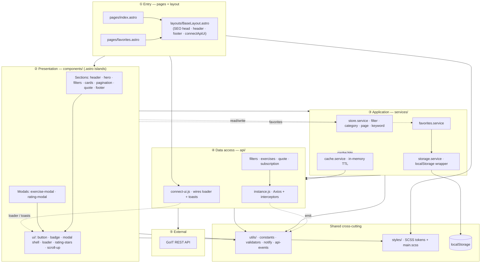
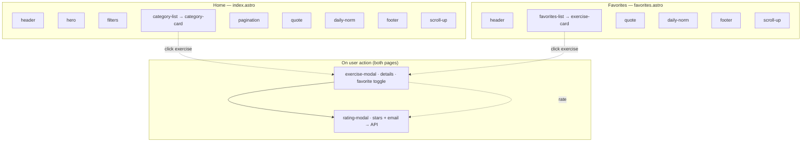
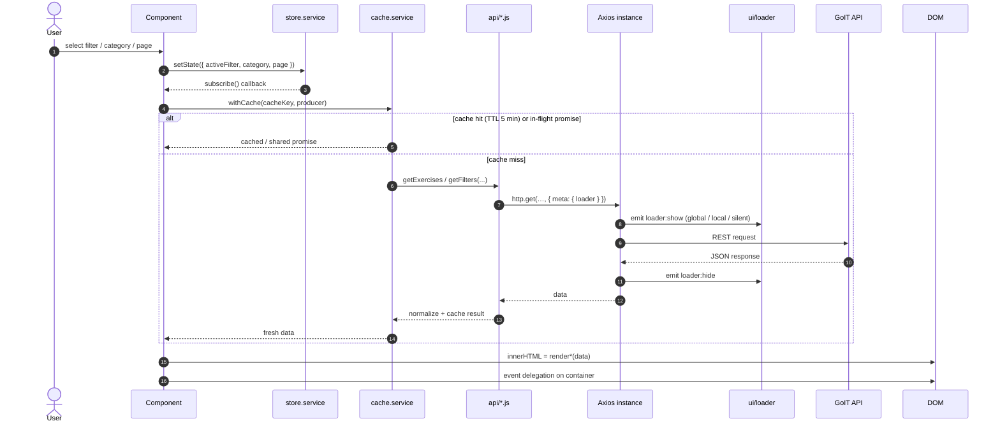

# Your Energy

> Adaptive fitness-exercise catalog with filtering, favorites, detail modals, ratings, and a newsletter subscription. Team project for the **MSc in Software Engineering & AI**, built with **Astro (static site) + vanilla-JS islands — no UI framework**.

<p>
  
  
  
  
</p>

## Table of Contents

- [Features](#features)
- [Tech Stack](#tech-stack)
- [Getting Started](#getting-started)
- [Scripts](#scripts)
- [Project Structure](#project-structure)
- [Architecture](#architecture)
  - [Overview](#overview)
  - [Layer model](#layer-model)
  - [Pages & components](#pages--components)
  - [Data flow](#data-flow)
- [Working in `src/` (per-folder guide)](#working-in-src-per-folder-guide)
- [Usage Guide](#usage-guide)
  - [Shared State (store)](#shared-state-store)
  - [Rendering Components (template literals)](#rendering-components-template-literals)
  - [Loading Indicator (loader)](#loading-indicator-loader)
- [API Reference](#api-reference)
- [Code Quality](#code-quality)
- [Deployment](#deployment)
- [Contributing](#contributing)

## Features

- **Two pages** — Home (catalog) and Favorites, pre-rendered as static HTML by Astro.
- **Filtering** by Muscles / Body parts / Equipment with server-side pagination.
- **Search** within a selected category (submit-driven).
- **Exercise modal** with details, rating, and add/remove favorites.
- **Rating modal** — star rating + validated email, submitted to the API.
- **Favorites** persisted in `localStorage`, available offline across sessions.
- **Quote of the day** cached in `localStorage` with a date check (no redundant refetch).
- **Newsletter subscription** with email validation.
- **Centralized loader** and **toast notifications** wired through a single Axios instance.

## Tech Stack

| Area          | Choice                                                                                   |
| ------------- | ---------------------------------------------------------------------------------------- |
| Framework     | [Astro 7](https://astro.build/) — static output (`output: 'static'`), islands            |
| Markup        | `.astro` components — `src/pages/*.astro` + shared `src/layouts/BaseLayout.astro`        |
| Styles        | SCSS — global system (`abstracts`/`base`/`layout`) + scoped `<style>` per page           |
| Logic         | JavaScript ES6+ — vanilla islands; DOM rendering via template literals (no engine)       |
| HTTP          | [Axios](https://axios-http.com/) — single instance + interceptors                        |
| Notifications | [iziToast](https://izitoast.marcelodolza.com/), wrapped in `utils/notify.js`             |
| SEO           | Canonical + Open Graph/Twitter + JSON-LD in the layout, `@astrojs/sitemap`, robots.txt   |
| State         | Tiny custom observable store + `localStorage` services                                   |
| Tooling       | ESLint (flat config), Prettier (+ `prettier-plugin-astro`), Husky, lint-staged, `.nvmrc` |
| CI / Deploy   | GitHub Actions (quality gate) + GitHub Pages (`withastro/action` + `deploy-pages`)       |

## Getting Started

**Prerequisites:** Node `>=22.12.0` (required by Astro 7; pinned in [`.nvmrc`](.nvmrc)). Odd-numbered Node releases are not supported.

```bash
nvm use            # match the pinned Node version
npm install        # also installs the Husky git hooks (via "prepare")
npm run dev        # Astro dev server → http://localhost:4321
```

## Scripts

| Command                | Description                                            |
| ---------------------- | ------------------------------------------------------ |
| `npm run dev`          | Start the Astro dev server.                            |
| `npm run build`        | Static build of **both** pages + sitemap into `dist/`. |
| `npm run preview`      | Preview the production build locally.                  |
| `npm run lint`         | Lint all JS sources with ESLint.                       |
| `npm run lint:fix`     | Lint and auto-fix.                                     |
| `npm run format`       | Format the codebase with Prettier (writes files).      |
| `npm run format:check` | Verify formatting without writing (used in CI).        |

## Project Structure

```
your-energy/
├── public/                  # static assets served as-is (favicon, og-image, robots.txt)
├── .github/                 # CI + deploy workflows + CODEOWNERS
├── astro.config.mjs         # Astro config: site, base, sitemap, SCSS
├── tsconfig.json            # extends astro/tsconfigs/base (editor IntelliSense)
└── src/
    ├── pages/               # index.astro, favorites.astro — routed pages
    ├── layouts/             # BaseLayout.astro — shared <head>/SEO + chrome
    ├── api/                 # Axios instance, normalizers, endpoint modules (no DOM)
    ├── components/          # components: *.astro (markup) + *.js/*.scss co-located
    │   └── ui/              # reusable primitives (button, loader, badge, …)
    ├── services/            # store, favorites, cache, storage (state orchestration)
    ├── utils/               # constants, validators, notify, api-events
    ├── styles/              # abstracts / base / layout + main.scss (global system)
    └── env.d.ts             # Astro type references
```

## Architecture

Organized **by feature, not by type**, with strict layer boundaries:

- **`api/`** never touches the DOM. All HTTP goes through the shared `http` instance ([`api/instance.js`](src/api/instance.js)); loader and toast side effects are emitted as events and wired once via [`api/connect-ui.js`](src/api/connect-ui.js) in the layout script.
- **`services/`** never call the backend directly — they orchestrate `api/` together with the store, cache, and storage.
- **`components/`** only render and listen for events. They read shared state from [`services/store.service.js`](src/services/store.service.js) and persist favorites via [`services/favorites.service.js`](src/services/favorites.service.js).
- **No raw `localStorage` / `JSON.parse`** outside [`services/storage.service.js`](src/services/storage.service.js).
- **No barrel imports** — import directly from the source file.

### Layer model

Dependency direction is **one-way**: `pages (.astro) → layout → components (.astro islands) → services → api`. `utils` is shared everywhere; `styles` are consumed by the layout and components. Astro pre-renders pages to static HTML; a component adds a co-located `<script>` to hydrate its island on the client only when it needs interactivity. Interceptors emit UI events via [`utils/api-events.js`](src/utils/api-events.js); the layout calls [`connectApiUi()`](src/api/connect-ui.js) once to attach the loader and toasts — `api/` itself stays UI-agnostic.



### Pages & components

Each page composes `.astro` components inside `BaseLayout`. Every section renders its structure to **static HTML at build time**, then hydrates as an [island](https://docs.astro.build/en/concepts/islands/) via a co-located `<script>` that calls its `init<Name>(root)` seam — browser JS ships per component, only for what's wired ([Astro: client-side scripts](https://docs.astro.build/en/guides/client-side-scripts/)). Modals are **not** rendered on load — they open on user action.



### Data flow

Typical catalog flow: a component updates the store, subscribers react, a service fetches through the cache layer, Axios handles loader + errors, and the component re-renders with template literals.



## Working in `src/` (per-folder guide)

What belongs in each folder, the rules, and a minimal example. The dependency direction is one-way: `pages → layout → components → services → api`, with `utils` shared by all and `styles` consumed by the layout/`components`. Never import "upwards" (e.g. `api` importing a component). UI side effects from interceptors go through [`utils/api-events.js`](src/utils/api-events.js) and are wired once in [`api/connect-ui.js`](src/api/connect-ui.js) from the layout.

### `src/api/` — backend access

One module per API resource plus the shared axios instance and response normalizers. **No DOM, no business logic, no state.** Each function imports `http`, validates the response shape via [`normalizers.js`](src/api/normalizers.js), and accepts an optional `{ loader }` target.

```js
// api/quote.api.js
import { http } from './instance.js';
import { normalizeQuote } from './normalizers.js';
import { ENDPOINTS } from '../utils/constants.js';

export async function getQuote({ loader } = {}) {
  const { data } = await http.get(ENDPOINTS.quote, { meta: { loader } });
  return normalizeQuote(data);
}
```

> Add new endpoints here, never call `axios` directly from a component, put the URL in [`utils/constants.js`](src/utils/constants.js), and add a guard in `normalizers.js` for the response shape.

### `src/utils/` — pure helpers & constants

Stateless, side-effect-free helpers and shared constants. **No DOM, no HTTP, no state** — except [`api-events.js`](src/utils/api-events.js), a tiny pub/sub bus used by Axios interceptors to emit loader/notify events without importing UI modules. One helper group per file; constants live in [`constants.js`](src/utils/constants.js).

```js
import { isValidEmail } from '../utils/validators.js';
import { EMAIL_PATTERN, STORAGE_KEYS } from '../utils/constants.js';

if (!isValidEmail(email)) notifyError('Invalid email');
```

> A literal used in ≥2 places, or a shared contract (endpoint, storage key, regex), goes here. A one-off string stays inline at its call site.

### `src/services/` — state & orchestration

The stateful layer: the observable **store**, **favorites** (localStorage), **cache** (TTL + in-flight deduplication), and the **storage** wrapper. Services orchestrate `api/` + persistence + state. **No DOM, no markup.** This is the only place allowed to touch `localStorage` (via [`storage.service.js`](src/services/storage.service.js)).

```js
// a feature flow: cache the request, then publish to the store
import { getExercises } from '../api/exercises.api.js';
import { withCache } from '../services/cache.service.js';
import { setState, getState } from '../services/store.service.js';

export async function loadExercises() {
  const { category, page, keyword } = getState();
  const key = `exercises:${category?.name}:${page}:${keyword}`;
  // map the filter type (Muscles/Body parts/Equipment) to its query param
  const data = await withCache(key, () =>
    getExercises({ ...toExerciseParams(category), keyword, page }),
  );
  return data;
}
```

> See [Shared State (store)](#shared-state-store) for the store contract.

### `src/components/` — views

Feature components are `.astro` files (static markup + optional co-located `<script>`); reusable `ui/` primitives are framework-agnostic `*.js` helpers. Component styles live in co-located `*.scss`. A component **renders markup and, when interactive, wires its own listeners and reads/writes the store** — it never calls the API directly. See [Rendering Components](#rendering-components-template-literals) for the full pattern.

**Where component logic lives:**

- **Cross-cutting logic** (HTTP, store, cache, storage, validators, events) → `api/`, `services/`, `utils/`. Framework-agnostic ESM, imported by any island.
- **Component logic** → a co-located `<name>.client.js` module next to the `.astro`, exporting `init<Name>(root)` and wired by a thin `<script>`. This keeps one folder per component and one obvious home for browser logic.

Every section follows the **uniform island contract** — `Component.astro` (static host with a `data-component` hook) + `<name>.client.js` (`init<Name>(root)` seam) + `<script>` that wires them:

```astro
<ul class="category-list" data-component="category-list"></ul>

<script>
  import { initCategoryList } from './category-list.client.js';

  initCategoryList(document.querySelector('[data-component="category-list"]'));
</script>
```

> **Current state — the contract is wired everywhere; logic is stubbed except working references.** Each section renders a visible dashed placeholder at build time and calls its `init<Name>(root)` seam on the client. Fill the seam (reuse `api/` + `services/` + `utils/`) and keep the `data-component` hook so loaders/queries keep targeting it.
>
> - **Sections** (`header`, `hero`, `filters`, `category-list`, `exercise-card`, `pagination`, `daily-norm`, `footer`, `quote`) ship a static placeholder + an empty or partial `init<Name>(root)` seam.
> - **Working references** — [`category-list`](src/components/category-list/category-list.client.js) (fetch + store + inline loading states) and [`scroll-up`](src/components/ui/scroll-up/scroll-up.client.js) (show-on-scroll + scroll-to-top).
> - **Modals** (`exercise-modal`, `rating-modal`) export `open<Name>(...)` and open on user action (not on load). The shell — backdrop, close button, X / backdrop / Escape handling, **focus trap, body scroll lock, focus restore, accessible name**, listener cleanup, and "one modal at a time" — lives in the `ui/modal` primitive ([`openModal`](src/components/ui/modal/modal.js)); each modal supplies only its body content and an `aria-label`.
> - **`ui/` primitives are JS by design, not `.astro`.** Lists (categories, exercises, pagination) are rendered on the client via `innerHTML`, and an `.astro` component cannot be embedded in a runtime HTML string. So `ui/button`, `ui/badge`, `ui/rating-stars` export pure `render<Name>(props)` string builders composed inside those client islands; `ui/loader` and `ui/modal` are imperative runtime primitives (overlay + modal shell). Converting them to `.astro` would create an unusable second source of truth — avoid it.

### `src/pages/` — routed pages

File-based routes — `index.astro` (Home) and `favorites.astro`. Each wraps its content in `BaseLayout`, composes `.astro` components, and authors the page-section layout in a scoped `<style lang="scss">`. **No bootstrap/rendering logic here** — components own their own client scripts.

```astro
---
import Hero from '../components/hero/Hero.astro';
import Quote from '../components/quote/Quote.astro';
import BaseLayout from '../layouts/BaseLayout.astro';
---

<BaseLayout title="Your Energy" description="Fitness exercises catalog">
  <main>
    <h1 class="visually-hidden">Your Energy — fitness exercises catalog</h1>
    <Hero />
    <Quote />
  </main>
</BaseLayout>

<style lang="scss">
  @use '../styles/abstracts' as *; // tokens/mixins only — emits no CSS

  .exercises {
    padding-block: 40px;
  }
</style>
```

### `src/layouts/` — shared shell

[`BaseLayout.astro`](src/layouts/BaseLayout.astro) owns the document shell: `<head>` SEO (title, description, canonical, Open Graph/Twitter, JSON-LD, favicon, sitemap link), global styles (`modern-normalize` + `main.scss`), the shared chrome (`Header`, `Footer`, `ScrollUp`, `#modal-root`), and the single `connectApiUi()` call that wires loader/toasts. Pages pass `title` / `description` (and optional `ogImage`) as props.

### `src/styles/` — SCSS system

`abstracts/` (design tokens, mixins, functions — **emits no CSS**), `base/` (reset, typography, global), `layout/`, and the [`main.scss`](src/styles/main.scss) aggregator (global, imported in `BaseLayout`). Component styles are co-located and `@use`'d from `main.scss`; **page-section layout lives in the scoped `<style>` of each `.astro` page** (hybrid: global system + scoped per page).

```scss
// components/exercise-card/exercise-card.scss
@use '../../styles/abstracts' as *;

.exercise-card {
  padding: 16px;
  border-radius: $radius-md; // token, never a hardcoded value
  color: $color-text;

  @include respond($bp-tablet) {
    padding: 24px;
  }
}
```

> Consume tokens via `@use '../abstracts' as *` — never hardcode colors/spacing. After adding a new component `.scss`, register it in [`main.scss`](src/styles/main.scss).

## Usage Guide

The three patterns below are the project's shared conventions. Follow them so ten contributors produce one consistent codebase.

### Shared State (store)

[`services/store.service.js`](src/services/store.service.js) is a tiny observable holding the **single source of truth** for shared UI state: `activeFilter`, `category`, `page`, and `keyword`. Components read it, subscribe to changes, and mutate it **only** through `setState`. `getState()` and subscriber callbacks receive a **frozen shallow copy** — never mutate the returned object. The store never calls the API and never touches the DOM.

```js
import { getState, setState, subscribe } from '../services/store.service.js';

// Read current state
const { category, page, keyword } = getState();

// Mutate — every subscriber is notified
setState({ page: 2 });

// React to changes; ALWAYS unsubscribe on teardown (e.g. closing a modal)
const unsubscribe = subscribe((state) => {
  renderExerciseList(state);
});
// later…
unsubscribe();
```

**Why a store?** Without one, each component keeps its own copy of `page` / `category` / favorites and they drift out of sync (e.g. pagination advances but the list stays behind). One source of truth, with subscriptions, keeps every view consistent and keeps components decoupled — pagination doesn't hold a reference to the list, it just writes to the store. Tasks that share state (category selection → exercises → pagination → modal → rating) coordinate exclusively through it.

### Rendering Components (template literals)

There is **no template engine**. Each component exports a pure `render*` function that returns an HTML string built with template literals. The caller injects the markup and then wires listeners.

```js
// components/exercise-card/exercise-card.js
import { escapeHtml } from '../../utils/escape-html.js';

export function renderExerciseCard(exercise) {
  return `
    <article class="exercise-card" data-id="${exercise._id}">
      <h3 class="exercise-card__title">${escapeHtml(exercise.name)}</h3>
      <button class="exercise-card__start" type="button">Start</button>
    </article>
  `;
}
```

```js
// where the list is mounted
container.innerHTML = exercises.map(renderExerciseCard).join('');

// Wire events once on the container (event delegation), not per card
container.addEventListener('click', (event) => {
  const card = event.target.closest('.exercise-card');
  if (card) openExerciseModal(card.dataset.id);
});
```

**Conventions:**

- Keep render functions **pure** — data in, string out. No fetching, no global state reads inside the template.
- **Escape any API- or user-provided string** before interpolating it into markup to avoid XSS.
- Prefer **event delegation** on a stable parent over attaching listeners to every rendered node.
- When a component owns listeners that outlive a render (modals, document-level `keydown`), expose a teardown that removes them.

### Loading Indicator (loader)

The loader is **fully centralized in the Axios interceptors** — feature code never calls `showLoader` / `hideLoader`. Interceptors emit `loader:show` / `loader:hide` events; [`connectApiUi()`](src/api/connect-ui.js) attaches the loader handlers once from `BaseLayout`. Each request declares a target via `config.meta.loader`. Targets are reference-counted by **selector string** (not DOM node reference), so parallel requests to the same target won't hide it early and re-renders of a local container won't orphan the overlay.

```js
import { LOADER } from '../utils/constants.js';
import { setButtonLoading } from '../components/ui/button/button.js';

// 1) Global overlay (default) — pass nothing
await getQuote();

// 2) Local overlay inside a specific container
await getExercises(params, { loader: '[data-component="exercise-list"]' });
await getFilters({ filter }, { loader: '[data-component="category-list"]' });

// 3) Silent — no overlay; the form's button shows its own spinner
setButtonLoading(sendBtn, true);
try {
  await rateExercise(id, payload, { loader: LOADER.SILENT });
} finally {
  setButtonLoading(sendBtn, false);
}
```

**Rule of thumb:** lists / pagination → **local**, rating & subscription forms → **silent + button spinner**, modal opening and everything else → **global**.

## API Reference

Base URL: `https://your-energy.b.goit.study/api` · [Swagger docs](https://your-energy.b.goit.study/api-docs)

| Purpose            | Method | Endpoint                |
| ------------------ | ------ | ----------------------- |
| Filters/categories | GET    | `/filters`              |
| Exercises list     | GET    | `/exercises`            |
| Exercise details   | GET    | `/exercises/:id`        |
| Add rating         | PATCH  | `/exercises/:id/rating` |
| Quote of the day   | GET    | `/quote`                |
| Subscription       | POST   | `/subscription`         |

Email contract (rating + subscription): `^\w+(\.\w+)?@[a-zA-Z_]+?\.[a-zA-Z]{2,3}$`

## Code Quality

Quality is enforced at two layers:

- **On commit** — Husky runs `lint-staged`, which auto-fixes staged files (`eslint --fix` + `prettier --write` for JS, `prettier --write` for SCSS/JSON/MD). Badly formatted code is corrected before it lands.
- **On push / pull request** — the [code-quality workflow](.github/workflows/code-quality.yml) runs on `develop` and `main`: `lint`, `format:check`, and `build`. A red check blocks the merge when branch protection requires status checks. A separate [deploy workflow](.github/workflows/deploy.yml) publishes to GitHub Pages on push to `main`.

Run the full gate locally before opening a PR:

```bash
npm run lint
npm run format:check
npm run build
```

## Deployment

Deployed to **GitHub Pages** by the [`deploy.yml`](.github/workflows/deploy.yml) workflow on push to `main` (via `withastro/action` + [`actions/deploy-pages`](https://github.com/actions/deploy-pages)). Day-to-day development happens on `develop`; merge `develop` → `main` via pull request when a release is ready.

Enable **Settings → Pages → Build and deployment → Source: GitHub Actions** once in the repository.

`site` and `base` are configured in [`astro.config.mjs`](astro.config.mjs): `site: https://deluminor.github.io`, `base: /your-energy`. For a different repo name or a custom domain, override the base via the `ASTRO_BASE` env var (e.g. `ASTRO_BASE=/` for a root/custom-domain deploy).

## Contributing

### Branch workflow

| Branch                       | Role                                                        |
| ---------------------------- | ----------------------------------------------------------- |
| `develop`                    | Default integration branch — feature work merges here first |
| `main`                       | Production / deployable — GitHub Pages deploys from here    |
| `feat/<task>` / `fix/<task>` | Short-lived topic branches off `develop`                    |

**Day-to-day flow:**

1. Update `develop` and branch off it:

   ```bash
   git checkout develop
   git pull origin develop
   git checkout -b feat/my-task
   ```

2. Commit with [Conventional Commits](https://www.conventionalcommits.org/) — `type(scope): subject` (e.g. `feat(filters): add active state toggle`).
3. Push and open a **pull request into `develop`** (not `main`).
4. Wait for CI (`Lint, format & build`) and a code-owner review ([`.github/CODEOWNERS`](.github/CODEOWNERS)).
5. When a release is ready, open a **pull request from `develop` into `main`**.

**Protected branches:** `main` and `develop` do not accept direct pushes — all changes go through reviewed pull requests.

### Code boundaries

Keep the layer rules in [Architecture](#architecture) — `api/` has no DOM, `services/` don't call the backend directly, `components/` only render and react to the store, interceptors emit UI events instead of importing components. No barrel imports.

### Before a PR

Run the full quality gate locally:

```bash
npm run lint
npm run format:check
npm run build
```
